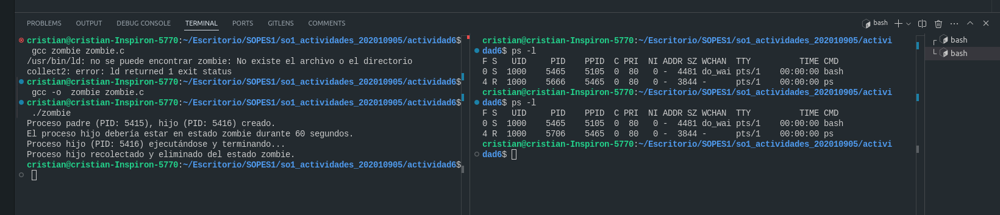

# Actividad 6

## Pregunta 1: ¿Cuántos procesos son creados por el programa?
### *El número total de procesos creados es 8, incluyendo el proceso original.*
### Código:

```c
#include <stdio.h>
#include <unistd.h>

int main()
{
    /* fork a child process */
    fork();

    /* fork another child process */
    fork();

    /* and fork another */
    fork();

    return 0;
}
```


## Pregunta 2: Programa que crea un proceso zombie `en Linux
Compila el programa con el siguiente comando:
```gcc -o zombie_program zombie_program.c```

Ejecuta el  programa:
`./zombie_program
`

Ejecutar el siguiente comando en otra terminal para ver el estado del proceso hijo:
`ps -l
`

### Código:

```c
#include <stdio.h>
#include <stdlib.h>
#include <unistd.h>
#include <sys/types.h>
#include <sys/wait.h>

int main() {
    pid_t pid = fork();

    if (pid < 0) {
        perror("fork() error");
        exit(1);
    } else if (pid == 0) {
        printf("Proceso hijo (PID: %d) ejecutándose y terminando...\n", getpid());
        exit(0);  
    } else {
        printf("Proceso padre (PID: %d), hijo (PID: %d) creado.\n", getpid(), pid);
        printf("El proceso hijo debería estar en estado zombie durante 60 segundos.\n");

        sleep(60);

        wait(NULL);

        printf("Proceso hijo recolectado y eliminado del estado zombie.\n");
    }

    return 0;
}
```



## Pregunta 3: ¿Cuántos procesos y hilos son creados?

### Código:

```c
#include <stdio.h>
#include <stdlib.h>
#include <unistd.h>
#include <pthread.h>  // Librería para manejar hilos

void* thread_function(void* arg) {
    printf("Hilo creado (ID del hilo: %lu)\n", pthread_self());
    return NULL;
}

int main() {
    pid_t pid;
    pthread_t thread_id;

    pid = fork();  // Primera llamada a fork()

    if (pid < 0) {
        // Error en la creación del proceso
        perror("fork() error");
        exit(1);
    } else if (pid == 0) {
        // Este es el proceso hijo
        printf("Proceso hijo (PID: %d) creado.\n", getpid());
        
        fork();  // Segunda llamada a fork() dentro del proceso hijo

        // Crear un hilo en el proceso hijo
        pthread_create(&thread_id, NULL, thread_function, NULL);
        pthread_join(thread_id, NULL);  // Esperar a que el hilo termine
    }

    // Tercera llamada a fork() en ambos procesos (padre e hijo)
    fork();

    // Evitar que los procesos terminen de inmediato
    sleep(1);

    return 0;
}

